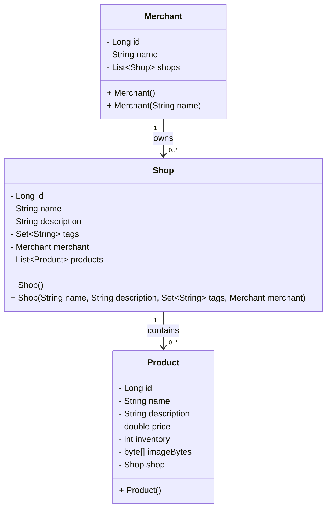

# Milestone 1 UML Model Diagram

```mermaid
classDiagram

class Merchant {
    - Long id
    - String name
    - List~Shop~ shops
    + Merchant()
    + Merchant(String name)
}

class Shop {
    - Long id
    - String name
    - String description
    - Set~String~ tags
    - Merchant merchant
    - List~Product~ products
    + Shop()
    + Shop(String name, String description, Set~String~ tags, Merchant merchant)
}

class Product {
    - Long id
    - String name
    - String description
    - double price
    - int inventory
    - byte[] imageBytes
    - Shop shop
    + Product()
}

Merchant "1" --> "0..*" Shop : owns
Shop "1" --> "0..*" Product : contains
```
